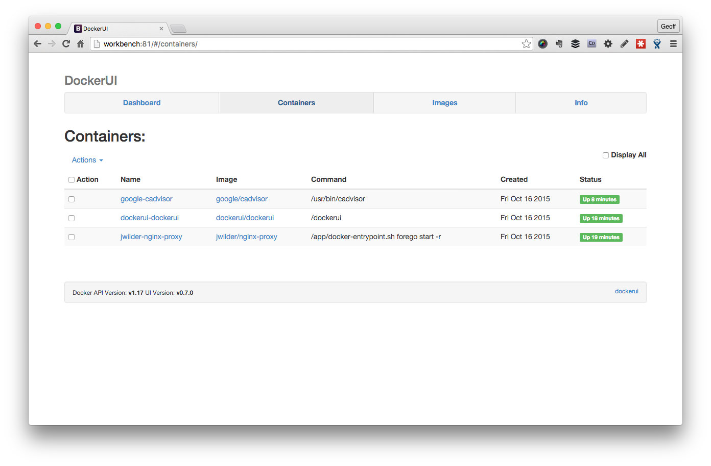
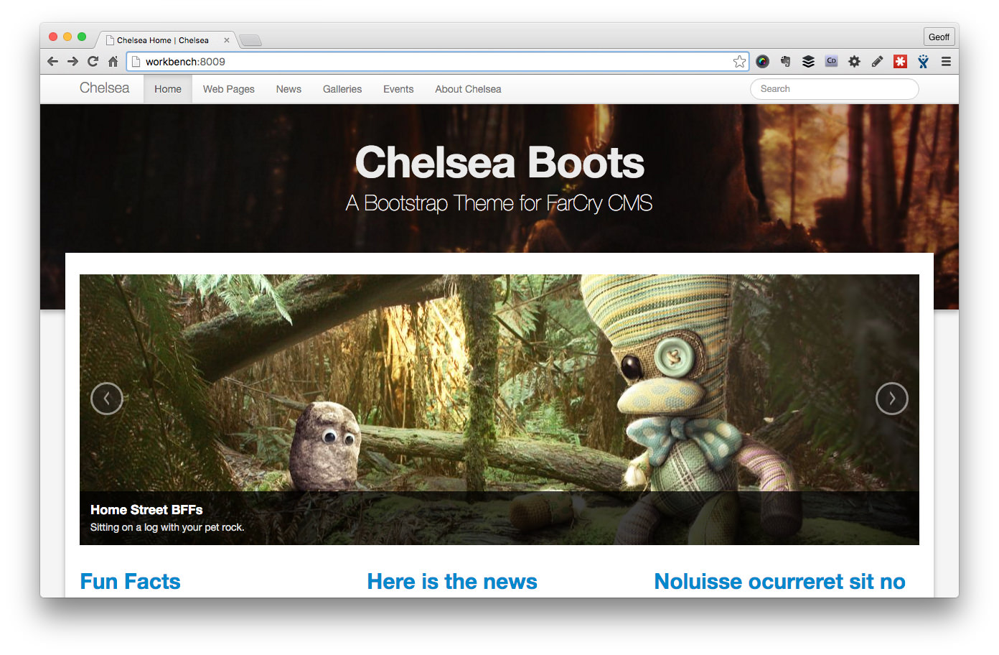

# Daemonite Docker Development Workbench

_Note this is a documentation project for setting up a dockerised development environment with Vagrant and Virtualbox.  Don't just clone and run because you won't get far ;)_

## Installation

1. install Git client (>1.6.5)

2. install Virtualbox (>5.x)
   If you are on Windows it's worth checking to see if there is a preferred build for the Windows version you are on; Virtual Box seems to have an ongoing love/hate relationship with Windows OS.

3. install [Vagrant (>1.7.4)](https://www.vagrantup.com/downloads.html)
   Vagrant is used to programatically control the configuration of our Docker VM.

4. install hostmanager plugin: 
   Hostmanager automatically updates your host file and puts in a "workbench.dev" entry for the virtual machine.

   `$ vagrant plugin install vagrant-hostmanager`
5. create a local projects directory (can be called anything): `$ mkdir ~/Workbench`

   `$ mkdir ~/Workbench`
6. copy [Workbench VM Vagrantfile](https://github.com/Daemonite/workbench/blob/master/Vagrantfile) into `~/Workbench` directory
   https://github.com/Daemonite/workbench/blob/master/Vagrantfile

Test installation and make sure everything is running by bringing up the Workbench DockerUI view:
```
cd ~/Workbench
vagrant up
open http://workbench.dev:81
```

_Note, you may be prompted for your admin password by `hostmanager` when it attempts to update your local hosts file._



Test drive a project, you will need a HOST entry pointing at the workbench IP (172.22.22.22) for chelsea-docker.dev:
```
cd ~/Workbench
git clone --recursive git@github.com:modius/chelsea-docker.git
cd chelsea-docker
vagrant up --no-parallel
open http://chelsea-docker.dev
```

_Note, all workbench projects run from *.dev so if you can wildcard that entry with DNSMASQ or equivalent so much the better._



## Workbench Cheat Sheet

### Global Workbench 
`cd ~/Workbench`
You need to be in the same directory as the Vagrantfile for workbench.

`vagrant up workbench`
Make sure the central work bench VM is running; its where the magic happens.

`vagrant global-status`
Check to see what's running and what's not running.

`vagrant provision workbench`
Clear out all running containers, and re-provision. Useful if something has gone wrong building a container.

`vagrant ssh workbench`
SSH onto the Boot2Docker VM and muck around.

### Project Specific
`$ cd ~/Workbench/my-env-project`
You need to be in the same directory as the Vagrantfile for your Project.

`vagrant up --no-parallel`
Bring up the default project containers sequentailly; makes sure your containers come up in the right order if they're linked.

`vagrant status`
Check the details of your specific project; what's running, container names, etc.

`vagrant reload mycontainer`
Rebuild your project's Docker image and start the container.

`vagrant docker-logs`
Tail the logs of all the containers running in your project.


## Overview

The Workbench assumes a simple hierarchy of Docker projects.  Each app or Docker image is isolated in its own Git repo.  Developers clone environment repos into their Workbench folder.

```
~/Workbench
├── Vagrantfile <-- Boot2Docker VM
├── aoc-env-corporate <-- git repo
│   ├── Dockerfile
│   ├── README.md
│   ├── Vagrantfile
│   ├── code
│   ├── config
│   └── logs
├── aoc-env-mediacentre <-- git repo
│   ├── Dockerfile
│   ├── README.md
│   ├── Vagrantfile
│   ├── code
│   ├── config
│   └── logs
└── aoc-env-rio2016 <-- git repo
    ├── Dockerfile
    ├── README.md
    ├── Vagrantfile
    ├── code
    ├── config
    └── logs
```

At the root of the Workbench folder is a Vagrantfile that defines the Workbench VM; Boot2Docker provisioned with useful tools.  Each environment project has its own Vagrantfile that looks for the shared Workbench VM (./Workbench/Vagrantfile) where it builds and deploys containers.

The makeup of a specific project environment repo is detailed in the specific README of each project skeleton; for example, Lucee Workbench or FarCry Workbench.

## Working with Workbench

Workbench uses a modern [Boot2Docker VM](https://github.com/dduportal/boot2docker-vagrant-box) to manage a Docker host for development. You can interact with this Docker host directly via a Docker client, by logging onto the VM or through Vagrant.

If you are new to Docker, it might be easier sticking to the simplified Vagrant commands before advancing to native Docker commands.

### Starting the Workbench

Workbench projects share a central VM called **workbench**. First thing you need to do is to get this running:  

```
cd ~/Workbench
vagrant up workbench
```

_Note, the first time you start a **workbench** VM it may have a bit of work to do to get everything in place; downloading the VM box, downloading common Docker images, and setting things up. Subsequent start-ups will be **much** faster._

You can see the status of the **workbench** virtual machine (VM) at any time by checking which VMs are running:
```bash
$ vagrant global-status
id       name            provider   state              directory                                 
-------------------------------------------------------------------------------------------------   
a8cd80e  dockerhost      virtualbox poweroff           /Users/modius/Workbench/bng-env-spp            
61dddef  spp             docker     host state unknown /Users/modius/Workbench/bng-env-spp            
e65746b  workbench       virtualbox running            /Users/modius/Workbench                        
6564df4  mysql           docker     running            /Users/modius/Workbench/gpml-env-prime         
6e8e8cb  gpml-solo       docker     running            /Users/modius/Workbench/gpml-env-prime         
97bfa2b  farcrycore-solo docker     running            /Users/modius/Workbench/dae-env-farcrycore     
82db5d9  mysql           docker     running            /Users/modius/Workbench/dae-env-farcrycore     
8bf934f  mysql           docker     running            /Users/modius/Workbench/dae-env-daemon         
63e99df  daemon-solo     docker     running            /Users/modius/Workbench/dae-env-daemon         
```

If you are in the root directory of a specific environment project you can check the status of that specific project:
```
$ cd ~/Workbench/gpml-env-prime
$ vagrant status
Current machine states:

gpml                      not created (docker)
mysql                     running (docker)
gpml-solo                 running (docker)
dockerhost                poweroff (virtualbox)
```

_Note, the **dockerhost** VM is a backup host that you can run in the absence of the central **workbench** VM; for example, if you only have the environment project and not the whole Workbench set up.  If you are using the **workbench** VM the **dockerhost** VM is redundant. If you have a **dockerhost** VM running you can safely stop it with `vagrant halt dockerhost` or even destroy it with `vagrant destroy dockerhost`._

Also, have a look at the internals of your Workbench by running the Docker UI that is provisioned by default when the **workbench** starts:
```
open http://workbench:81
```

### Starting your development environment

The specific project you are working on controls the behaviour of your development environment. Switch to your project folder and start its containers:

```
cd ~/Workbench/gpml-env-prime
vagrant up --no-parallel
```

If its the first time you have started the project it will build all the relevant Docker containers, downloading any dependencies that may be missing.

You reach the web app through `http://projectname.dev` where `.dev` is a suffix of your choice. You will need to set up a wildcard for `*.dev` (for example, using DNSMASQ) or a separate HOST entry for each project you are working with.

The first part of the output from a vagrant command should show the hostname for the project you are working on.

Every project should be designed to start up in its most common configuration. However, some projects have various configuration options; check the project's README for details.  For example, your project may support solo development with a local mysql db and collaborative development with a shared office db.

### Code changes & Image Rebuilds

Any code changes that you make will be reflected immediately in your application; ie. changes to files within the `./projectname/code` branch. This area is shared with your Docker container in real time.

If you make changes to the environment project will require you to rebuild the Docker container.  You can rebuild the Docker image and restart the specific container, for example:
```
$ vagrant reload gpml-solo
==> gpml-solo: Stopping container...
==> gpml-solo: Deleting the container...
==> gpml-solo: Syncing folders to the host VM...
    gpml-solo: Mounting shared folders...
    gpml-solo: /var/lib/docker/docker_1445210888_51157 => /Users/modius/code/gpml-env-prime
    gpml-solo: /var/lib/docker/docker_build_7c1f2b280e255fed5efe4885765cdf40 => /Users/modius/code/gpml-env-prime
==> gpml-solo: Building the container from a Dockerfile...
    gpml-solo: Sending build context to Docker daemon 524.6 kB
...snip...8<...time passess...
    gpml-solo: Successfully built 5f44b81bfc43
    gpml-solo: Image: 5f44b81bfc43
==> gpml-solo: Warning: When using a remote Docker host, forwarded ports will NOT be
==> gpml-solo: immediately available on your machine. They will still be forwarded on
==> gpml-solo: the remote machine, however, so if you have a way to access the remote
==> gpml-solo: machine, then you should be able to access those ports there. This is
==> gpml-solo: not an error, it is only an informational message.
==> gpml-solo: Creating the container...
    gpml-solo:   Name: 7001-gpml
    gpml-solo:  Image: 5f44b81bfc43
    gpml-solo: Volume: /vagrant/gpml-env-prime/code:/var/www/farcry
    gpml-solo: Volume: /vagrant/gpml-env-prime/config/lucee/lucee-web.xml.cfm:/opt/lucee/web/lucee-web.xml.cfm
    gpml-solo: Volume: /vagrant/gpml-env-prime/logs/lucee:/opt/lucee/web/logs
    gpml-solo: Volume: /vagrant/gpml-env-prime/logs/nginx:/var/log/nginx
    gpml-solo: Volume: /vagrant/gpml-env-prime/logs/supervisor:/var/log/supervisor
    gpml-solo: Volume: /vagrant/gpml-env-prime/logs/tomcat:/usr/local/tomcat/logs
    gpml-solo: Volume: /var/lib/docker/docker_1445210888_51157:/vagrant
    gpml-solo:   Port: 7001:80
    gpml-solo:   Link: mysql-gpml:mysql
    gpml-solo:  
    gpml-solo: Container created: f0d2bc1975702e7c
==> gpml-solo: Starting container...
==> gpml-solo: Provisioners will not be run since container doesn't support SSH.
==> gpml-solo: Removing synced folders...
```

_Note, `vagrant status` will tell you the name of all the containers the project builds. OR check the project README for specific details on your project._


### Using secure connections

The [nginx proxy](https://github.com/jwilder/nginx-proxy) that Workbench uses supports
enabling SSL for all connections.

1. Add a `certs` directory to your workbench directory.
2. Add `VIRTUAL_HOST.key` and `VIRTUAL_HOST.crt` files to that directory, where
   VIRTUAL_HOST is the value set in the Vagrant docker config for the container.
3. Alternatively, you can use a specific certificate for a container by adding
   `"CERT_NAME" => "sharedcert"` as an environment variable on the container,
   where `sharedcert.key` and `sharedcert.crt` are the certificates you added.
4. In the workbench `Vagrantfile`, find the command to run `jwilder/nginx-proxy`
   and add `-p 443:443 -v /vagrant/certs:/etc/nginx/certs` to the arguments.
5. Reprovision workbench: `vagrant provision workbench`.
6. Reload your containers (see above).


## Workbench `Vagrantfile` explained

```ruby
################################################## 
# Daemonite Docker Workbench
# v1.0
##################################################
WORKBENCH_IP = "172.22.22.22"
Vagrant.require_version ">= 1.7.4"

Vagrant.configure("2") do |config|
  # configure hostmanager plugin; https://github.com/smdahlen/vagrant-hostmanager
  config.hostmanager.enabled = true
  config.hostmanager.manage_host = true
  config.hostmanager.ignore_private_ip = false
  config.hostmanager.include_offline = true
```

The IP address (defined at `WORKBENCH_IP`) can be changed as needed.  The Vagrant `hostmanager` plugin is used to set up a simple hostname alias of *workbench*.

```ruby
# setting that appears to help provisioning on Windows
config.ssh.forward_agent = true
```

SSH forwarding is normally set to false, but appears to be necessary to get the provisioning working properly on Windows.

```ruby
  ##################################################
  # Start Docker host
  ##################################################
  config.vm.define "workbench", autostart: true do |dh|  
    
    # configure virtual machine
    dh.vm.box = "dduportal/boot2docker"
    dh.vm.hostname = "workbench"
    dh.vm.network :private_network, ip: WORKBENCH_IP
    dh.hostmanager.aliases = %w(workbench.dev workbench)
    dh.vm.synced_folder ".", "/vagrant", type: "virtualbox"
```

The `dduportal/boot2docker` box is preferred as its more up to date than the default that comes with Vagrant.

We sync everything under the Workbench folder into the VM for convenience: `dh.vm.synced_folder ".", "/vagrant", type: "virtualbox"`

```
    dh.vm.provider "virtualbox" do |vb|
      vb.memory = 4096
      vb.cpus = 2
      vb.customize ["modifyvm", :id, "--nictype2", "virtio"]
    end

  end
```

The **Docker Host** is designed to hold the containers of several underlying projects, hence an initial setting of 4GB RAM and 2CPUs. These settings should be adjusted to suit your environment.

`vb.customize ["modifyvm", :id, "--nictype2", "virtio"]` is a network setting that seems to solve some problems for OSX users.  Feel free to remove or adjust to suit your environment.


```
  ##################################################
  # Provision Workbench
  ##################################################
  # clean up containers prior to provisioning
  config.vm.provision "shell", inline: <<-SHELL
    # clean up containers prior to provisioning
    docker rm --force `docker ps -qa`
    echo "Soaping.. Scrubbing.. Spongeing.. Docker cleaned!"
  SHELL

  config.vm.provision "docker" do |d|
    d.images = ["tutum/mysql:5.6", "lucee/lucee-nginx"]
    # start nginx-proxy; https://github.com/jwilder/nginx-proxy
    d.run "jwilder/nginx-proxy", args: "-p 80:80 -v '/var/run/docker.sock:/tmp/docker.sock:ro'"
    # start dockerui; https://github.com/crosbymichael/dockerui
    d.run "dockerui/dockerui", args: "-p 81:9000 --privileged -v '/var/run/docker.sock:/var/run/docker.sock' -e VIRTUAL_HOST='workbench,workbench.dev'"
    # start cAdvisor; https://github.com/google/cadvisor
    d.run "google/cadvisor", args: "-v '/:/rootfs:ro' -v '/var/run:/var/run:rw' -v '/sys:/sys:ro' -v '/var/lib/docker/:/var/lib/docker:ro' -p 82:8080 --detach=true"
  end

# /config
end
```

The Workbench is provisioned by:

- removing all containers (running or dead)
- importing common Docker images for development (feel free to adjust)
- setting up an [NGINX proxy](https://github.com/jwilder/nginx-proxy) to enable the use of hostnames with containers
- enabling [DockerUI](https://github.com/crosbymichael/dockerui) for visualising the contents of your Boot2Docker instance (saves having to SSH onto the box and do things manually)
- running [cAdvisor](https://github.com/google/cadvisor) for monitoring the health of the virtual machines containers

Enjoy.
